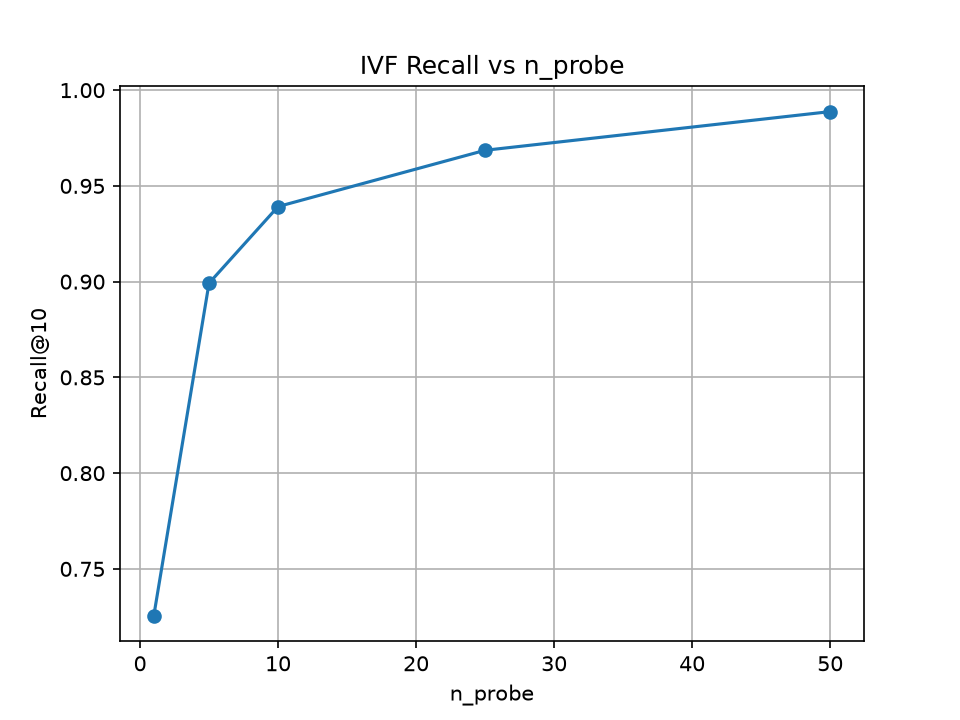
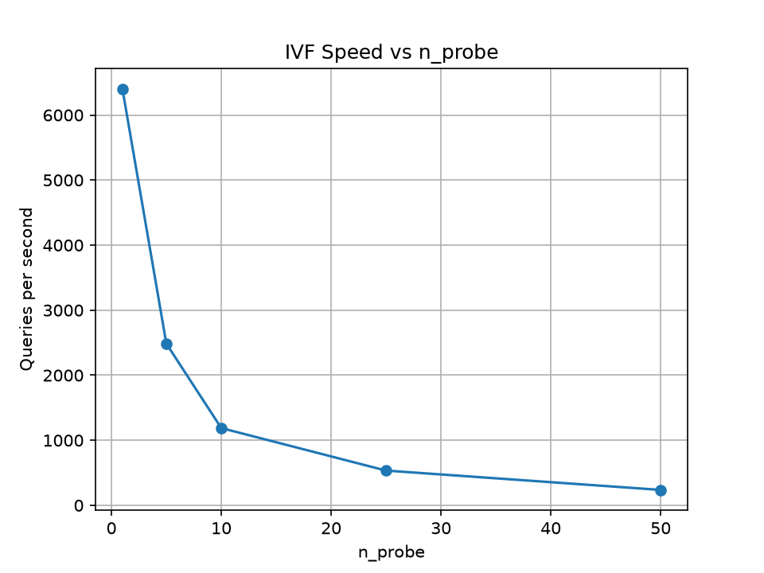
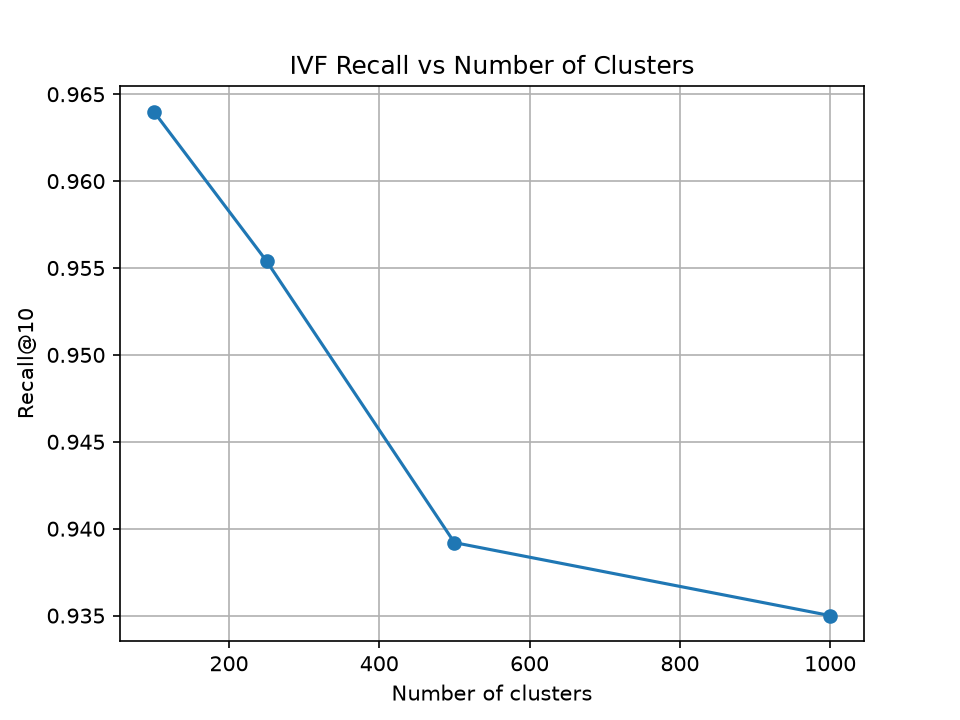
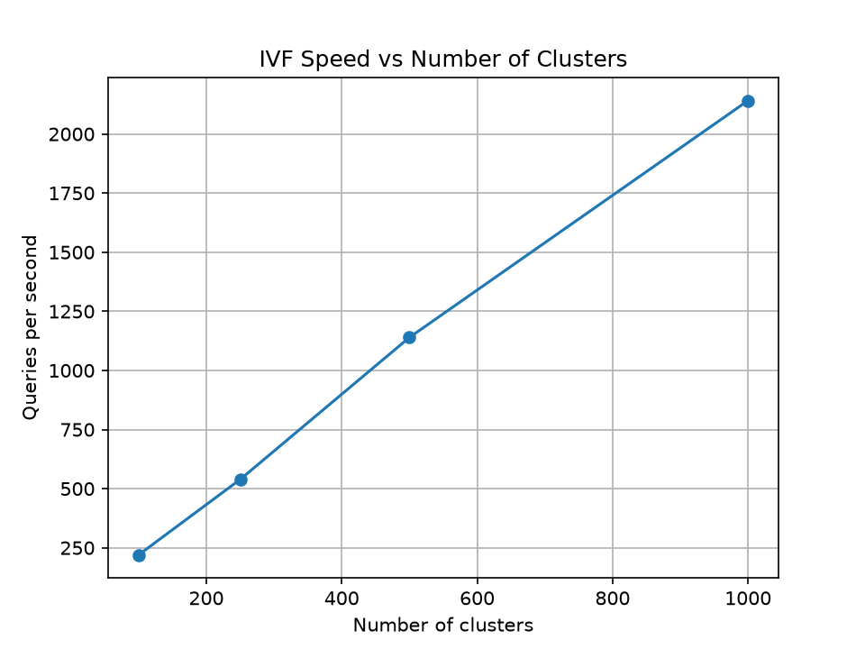

# Vector Database From Scratch

A vector search engine implemented from scratch using **NumPy** for indexing and similarity search, without using Pinecone, FAISS, Chroma, `sklearn.neighbors`, or any external vector indexing library.

The project implements both an **exact nearest-neighbour index** for ground truth and an **approximate IVF (Inverted File) index** with a configurable speed-vs-accuracy parameter.

---

## Problem Statement

The goal of this project is to understand and implement the core ideas behind vector databases and approximate nearest-neighbour search.

The system supports:

* Exact nearest-neighbour search
* Approximate nearest-neighbour search using IVF
* Configurable speed vs accuracy using `n_probe`
* Insert operations
* Delete operations
* Ground-truth evaluation
* Recall@10 measurement
* Queries-per-second (QPS) benchmarking
* Interactive semantic search from the terminal

The approximate index is intentionally simple and complete rather than using an external vector database or indexing library.

---

## Architecture

```text
                    AG News Dataset
                          |
                          v
              all-MiniLM-L6-v2
                          |
                          v
                 50,000 embeddings
                    384 dimensions
                          |
             +------------+------------+
             |                         |
             v                         v
       Exact Index                 IVF Index
       Brute Force              500 clusters
       Ground Truth                   |
             |                     n_probe
             |                         |
             +------------+------------+
                          |
                          v
                 Top-k Nearest Neighbours
```

---

## Dataset

The project uses the **AG News** dataset.

* 50,000 training texts
* Short real-world news statements
* Embedding model: `sentence-transformers/all-MiniLM-L6-v2`
* Embedding dimension: 384
* Similarity metric: cosine similarity

The embeddings are L2-normalized before indexing, so cosine similarity becomes a dot product:

```text
cosine_similarity(a, b) = normalized_a · normalized_b
```

The generated embeddings are intentionally excluded from Git because the dataset contains 50,000 vectors and would unnecessarily increase repository size.

They can be regenerated using the provided scripts.

---

## Indexes

### 1. Exact Index

The exact index performs brute-force nearest-neighbour search.

For every query:

1. Normalize the query vector.
2. Compute its similarity with every stored vector.
3. Select the top-k highest-scoring vectors.

This is the **ground truth** used to evaluate the approximate index.

The exact index guarantees that the returned nearest neighbours are the true nearest neighbours under the implemented cosine-similarity metric.

---

### 2. IVF Approximate Index

The approximate index uses an **Inverted File (IVF)** structure implemented from scratch.

During index construction:

1. Initialize cluster centroids using k-means++.
2. Assign every vector to its nearest centroid.
3. Recompute centroids.
4. Repeat the clustering process.
5. Store vector IDs in inverted lists corresponding to their clusters.

During search:

1. Find the nearest centroids to the query.
2. Select only the closest `n_probe` clusters.
3. Search vectors contained in those clusters.
4. Return the top-k nearest vectors from the candidate set.

This avoids comparing the query against all 50,000 vectors.

---

## Accuracy vs Speed Knob

The main tuning parameter is:

```text
n_probe
```

`n_probe` controls how many IVF clusters are searched for every query.

### Lower `n_probe`

* Searches fewer vectors
* Higher QPS
* Lower recall

### Higher `n_probe`

* Searches more vectors
* Lower QPS
* Higher recall
* Approaches exact search as more clusters are examined

This creates a direct accuracy-vs-speed tradeoff.

---

## Benchmark Methodology

The benchmark uses:

* 50,000 indexed vectors
* 500 query vectors
* Top-10 nearest neighbours
* Exact brute-force search as ground truth
* Recall@10 as the accuracy metric
* Queries per second (QPS) as the speed metric

Recall@10 is calculated as:

```text
Recall@10 =
(number of approximate results that appear in exact top-10)
/
10
```

The benchmark was run on the development machine, so QPS values are machine-dependent. Recall is the more important accuracy measurement.

---

## Benchmark Results

### Exact Search

```text
Exact Search
--------------------------------
QPS: 159.83
```

The exact index is used as the ground truth.

### IVF Search

| `n_probe` | Recall@10 | Queries/sec |
| --------: | --------: | ----------: |
|         1 |    72.56% |     6402.95 |
|         5 |    89.92% |     2485.26 |
|        10 |    93.92% |     1187.53 |
|        25 |    96.86% |      534.07 |
|        50 |    98.88% |      236.77 |

The results show the expected tradeoff:

* `n_probe=1` provides very high throughput but lower recall.
* Increasing `n_probe` improves recall.
* At `n_probe=50`, the index reaches **98.88% Recall@10**.
* At that setting it achieves approximately **236.77 QPS**, compared with **159.83 QPS** for the exact search on the benchmark machine.

### Recall vs `n_probe`



### Speed vs `n_probe`



---

## Effect of Number of Clusters

A second experiment evaluates how the number of IVF clusters affects performance.

For this experiment, `n_probe` was fixed at 10.

| Number of Clusters | Recall@10 | Queries/sec |
| -----------------: | --------: | ----------: |
|                100 |    96.40% |      219.79 |
|                250 |    95.54% |      538.91 |
|                500 |    93.92% |     1139.63 |
|               1000 |    93.50% |     2141.21 |

With a fixed `n_probe`, increasing the number of clusters means that the same number of probes covers a smaller fraction of the total index. This can improve search speed while reducing recall.

### Recall vs Number of Clusters



### Speed vs Number of Clusters



---

## Insert and Delete

The IVF index supports both insertion and deletion.

### Insert

When a new vector is inserted:

1. The vector is normalized.
2. Its nearest centroid is found.
3. The vector is assigned a new ID.
4. The ID is added to the corresponding inverted list.

Example:

```text
Inserted vector at index: 50000
```

### Delete

Deletion removes the vector ID from its inverted list.

The underlying vector storage is intentionally retained so that existing vector IDs remain stable.

Therefore:

* The deleted vector is no longer searchable.
* Its original ID is not reused.
* Physical memory reclamation is left as a future optimization.

---

## Interactive Demo

The project includes a terminal-based semantic search interface.

Run:

```bash
python src/main.py
```

Then enter any statement.

Example:

```text
Enter a statement: Apple shares rise after strong earnings

Top matches:
--------------------------------
1. 0.5935 | Stocks Rise After Durable Goods Data...
2. 0.5910 | Stocks Up on Earnings, Oil, Economic Data...
3. 0.5710 | Stocks Inch Up After Durable Goods Report...
4. 0.5662 | Stocks Climb As Profit Worries Ease...
5. 0.5632 | U.S. Stocks Rise, But Oil Surges Again...
```

The system converts the query into an embedding and retrieves semantically similar news articles using the custom IVF index.

Type:

```text
exit
```

to stop the program.

---

## Project Structure

```text
VectorDB_from_scratch/
│
├── data/
│   ├── embeddings.npy
│   └── texts.npy
│
├── plots/
│   ├── recall_vs_nprobe.png
│   ├── speed_vs_nprobe.png
│   ├── recall_vs_clusters.png
│   └── speed_vs_clusters.png
│
├── src/
│   ├── benchmark.py
│   ├── exact_index.py
│   ├── generate_embeddings.py
│   ├── ivf_index.py
│   ├── load_data.py
│   ├── main.py
│   ├── test_exact.py
│   ├── test_ivf.py
│   └── test_operations.py
│
├── README.md
├── requirements.txt
└── .gitignore
```

The `data/` directory is generated locally and is not committed to Git.

---

## Installation

Clone the repository and create a virtual environment:

```bash
git clone https://github.com/Vedant4102004/Vector-database-from-scratch-.git
cd Vector-database-from-scratch-

python -m venv venv
source venv/bin/activate
```

Install dependencies:

```bash
pip install -r requirements.txt
```

---

## Generate the Dataset and Embeddings

Generate the local dataset:

```bash
python src/load_data.py
```

Generate embeddings:

```bash
python src/generate_embeddings.py
```

This creates:

```text
data/embeddings.npy
data/texts.npy
```

The resulting embedding matrix contains:

```text
50,000 vectors × 384 dimensions
```

---

## Running the Tests

### Exact Search

```bash
python src/test_exact.py
```

### IVF Search

```bash
python src/test_ivf.py
```

### Insert and Delete

```bash
python src/test_operations.py
```

All three tests should complete successfully.

---

## Running the Benchmark

Run:

```bash
python src/benchmark.py
```

The benchmark:

1. Builds the exact index.
2. Computes exact ground truth for 500 queries.
3. Builds the IVF index.
4. Evaluates multiple `n_probe` values.
5. Measures Recall@10.
6. Measures QPS.
7. Evaluates different numbers of IVF clusters.
8. Saves benchmark plots to `plots/`.

---

## Design Decisions

### Why IVF?

IVF was selected because it provides a clear and understandable approximation mechanism while remaining small enough to implement completely from scratch.

It demonstrates the fundamental idea of approximate vector search:

```text
All vectors
    ↓
Partition into clusters
    ↓
Search only relevant clusters
    ↓
Rank candidate vectors
    ↓
Return nearest neighbours
```

### Why not HNSW?

HNSW is a powerful approximate nearest-neighbour algorithm, but implementing it correctly requires significantly more graph-management logic.

For this assignment, IVF provides a complete implementation with:

* Build
* Search
* Insert
* Delete
* Tunable search accuracy
* Measurable speed/accuracy tradeoff

This keeps the implementation focused on the core vector-search problem.

---

## Limitations

This implementation intentionally prioritizes simplicity and transparency.

Current limitations include:

* IVF centroids are not retrained after insertion.
* Deleted vectors remain in the underlying vector array to preserve stable IDs.
* The exact index is designed for ground-truth evaluation rather than high-performance production use.
* The benchmark is CPU-based and QPS depends on the machine.
* The system currently stores the index in memory rather than providing a persistent database format.
* The IVF implementation is optimized for understanding the algorithm rather than production-scale workloads.

---

## What Was Implemented From Scratch

The core vector-search functionality does **not** rely on an external vector database or nearest-neighbour library.

Implemented manually:

* Vector normalization
* Cosine similarity using NumPy
* Exact brute-force nearest-neighbour search
* k-means++ centroid initialization
* k-means clustering
* IVF inverted lists
* Approximate nearest-neighbour search
* `n_probe` search control
* Insert
* Delete
* Recall@10 evaluation
* QPS benchmarking

External libraries are used only for supporting tasks such as:

* Text embedding generation
* Dataset loading
* Numerical computation
* Plot generation

---

## Key Result

The final benchmark demonstrates that a simple IVF index written from scratch can achieve:

```text
98.88% Recall@10
236.77 queries/sec
```

at `n_probe=50` on the benchmark machine, while the exact brute-force implementation achieves approximately:

```text
159.83 queries/sec
```

The primary result of the project is not just the absolute speed, but the measurable and controllable **accuracy-vs-speed tradeoff** provided by the custom `n_probe` parameter.

---

## Technologies

* Python
* NumPy
* Sentence Transformers
* Hugging Face Datasets
* Matplotlib
* Git / GitHub

No Pinecone, FAISS, Chroma, `sklearn.neighbors`, or other vector indexing library is used.
